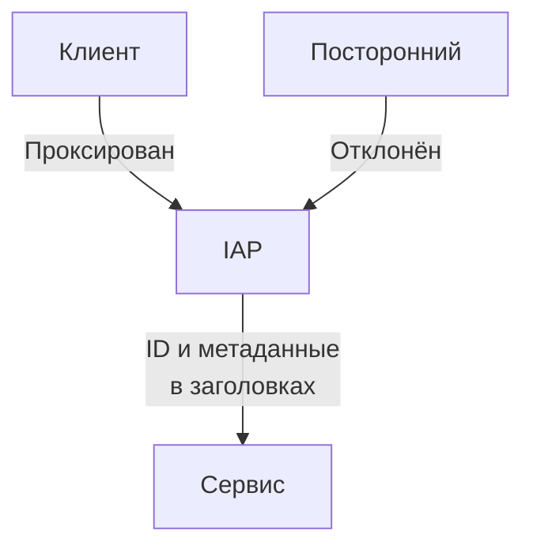
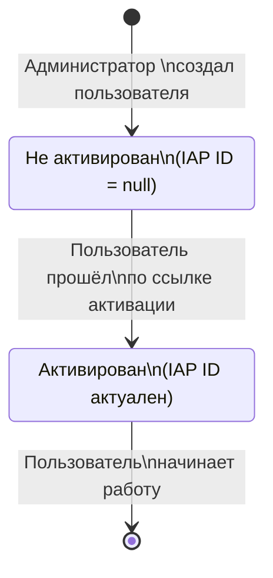

# Аутентификация через IAP

## Контекст и проблема

В рамках [контроля доступа](../usecases/01-access-control.md) нужно уметь аутентифицировать 
пользователей. Техническим заданием описана лишь модель авторизации, необходимо решить,
каким способом аутентифицировать пользователей, с учётом контекста системы.

## Рассмотренные варианты

- Самостоятельная реализация аутентификации (session-based или JWT).
- Делегирование аутентификации стороннему сервису (Auth0, Keycloak и т.д.)
- Полное вынесение логики аутентификации из приложения, использование <adr001:IAP>.

## Решение

Выбрана опция "использование IAP", так как в рамках корпоративного решения, предназначенного
для внутреннего пользования, это выглядит наилучшим вариантом: скорее всего в компании уже
есть подобная система для контроля доступа к внутренним сервисам, значит процесс 
интеграции будет облегчён.

### Последствия решения

- Хорошо, потому что само приложение становится проще — достаточно доверять любому пришедшему
  заголовку с ID и другими данными пользователя.
- Хорошо, потому что не нужно тратить время на реализацию/интеграцию во
  время создания прототипа.
- Хорошо, потому что, скорее всего, облегчит интеграцию с уже существующими сервисами компании.
- Плохо, потому что приложение не сможет полноценно функционировать самостоятельно.

### Реализация

Конкретное поведение при получении запроса определяется
реализацией <adr001:IAP>. Фиксируется, что при получении
запроса от аутентифицированного пользователя, IAP проксирует
запрос в сервис, при этом передавая такие заголовки:

- `X-User-Id` — идентификатор пользователя, строка
- `X-User-Email` — рабочий e-mail пользователя

Впоследствии, сервис использует эти данные для идентификации
и авторизации пользователя в своём контексте.

При создании нового пользователя (что предусмотрено ТЗ), администратор
указывает лишь его Email. Затем, один раз, при первом использовании
системы, пользователь должен будет "активировать" свой аккаунт — связать
свою электронную почту со своим идентификатором в IAP на стороне сервиса,
например, просто пройдя по ссылке активации. Сервис, в свою очередь,
ассоциирует IAP ID пользователя со своим внутренним ID.

## "За" и "против"

### Самостоятельная реализация

- Хорошо, потому что приложение сможет функционировать самостоятельно
- Очень плохо, потому что сложно сделать надёжный механизм с нуля
- Плохо, потому что возникнут сложности при интеграции в существующую
  корпоративную инфраструктуру.

### Делегирование (Auth0, Keycloak)

- Хорошо, потому что приложение снимает с себя часть ответственности
  за контроль доступа.
- Хорошо, потому что проще интегрировать.
- Плохо, потому что даже для работы прототипа придётся поднимать и
  настраивать такой сервис.

## Использованные термины

**adr001:IAP**
:   Identity Aware Proxy — прокси-сервер, забирающий на себя всю ответственность за 
    аутентификацию. Проксирует запросы аутентифицированных пользователей на конечный
    сервер, приводя в заголовках их пользовательские идентификаторы и другие метаданные.

**adr001:Аутентификация** 
:   — процесс проверки подлинности введённых учётных данных.

**adr001:Авторизация** 
:   — процесс предоставления пользователю прав в системе (после <adr001:Авторизация|авторизации>).

## Дополнительные материалы

- [Google IAP](https://cloud.google.com/security/products/iap)
- [Pomerium — OSS IAP](https://github.com/pomerium/pomerium)
- [Oakproxy — OSS IAP](https://github.com/wpbrown/oakproxy)
