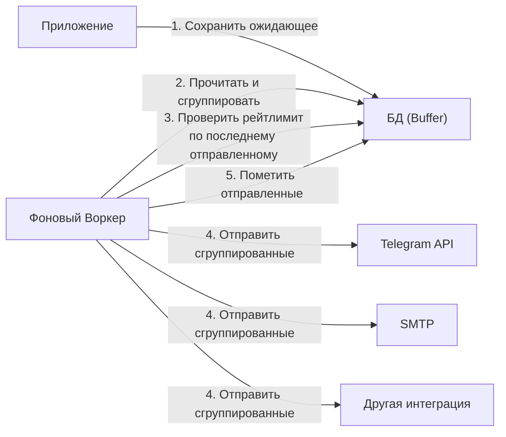
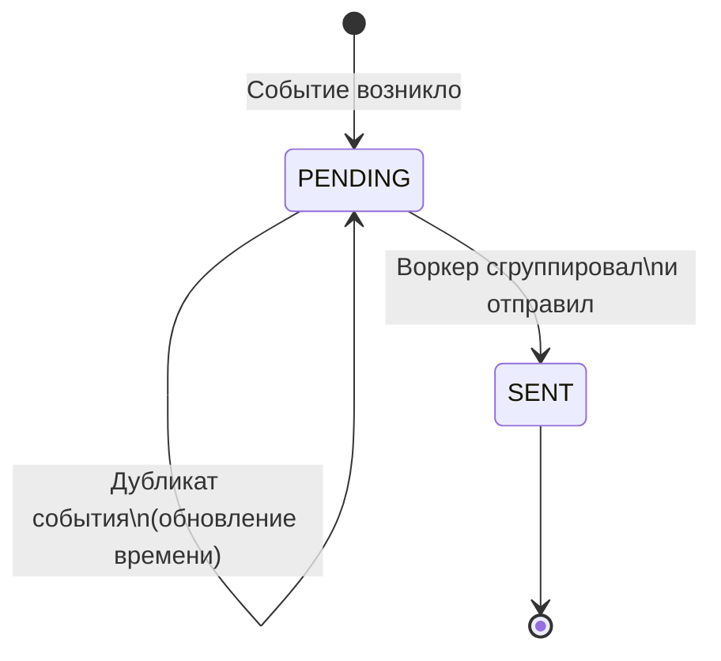

# Группировка и ratelimit оповещений

## Контекст и проблема

A/B платформа должна уметь отправлять оповещения по разным каналам. 

В рамках MVP поддерживаются:

- Каналы связи:

    - Telegram
    - Email

- Триггеры оповещений:

    - Смена статуса эксперимента
    - Срабатывание guardrail

ТЗ требует наличия:

- Дедупликации оповещений
- Группировки оповещений
- <notif:Ratelimit> оповещений

Для каждого правила оповещения задаётся свой ratelimit в секундах.

## Рассмотренные варианты

- Синхронная отправка с блокировкой
- Потоковая агрегация через очередь сообщений (Kafka/RabbitMQ)
- Асинхронная агрегация через буфер в БД

## Решение

Выбрана опция "буфер в БД", так как для MVP это наиболее надёжный вариант, 
удовлетворяющий ТЗ без внедрения сложной инфраструктуры (Kafka/RMQ).

### Последствия решения

- Хорошо, потому что решается проблема спама: пользователь получает 
  одно сообщение "5 ошибок" вместо 5 сообщений.
- Хорошо, потому что гарантируется сохранность событий (ACID) даже при падении сервиса рассылки.
- Плохо, потому что не функционирует в реальном времени — есть задержка доставки (latency) 
  равная интервалу работы воркера (30-60 сек).

### Реализация

Имеем паттерн Producer-Consumer через базу данных:

1. При оповещении приложение вычисляет <notif:Отпечаток>, и сохраняет запись в таблицу. 
   Если такой Отпечаток уже существует, обновляется лишь временная метка (дедупликация).
2. Воркер периодически вычитывает ожидающие уведомления, группирует их по правилам рассылки.
3. Воркер проверяет время последней отправки для группы.
   Если лимит не прошел — события остаются в буфере. 
   Если прошел — формируется и отправляется сводное сообщение.
   (форматирование по шаблону происходит на этом же этапе).

Отпечаток считается как хэш от ID Правила + ID Сущности, 
вызвавшей срабатывание (Guardrail ID или ID Эксперимента).

Жизненный цикл события:

## "За" и "против"

### Синхронная отправка (In-Memory)

- Хорошо, потому что моментальная доставка.
- Плохо, потому что теряется состояние при перезапуске сервиса.
- Очень плохо, потому что невозможна группировка (события приходят по одному, мы не знаем, что будет через секунду).

### Потоковая агрегация (Kafka)

- Хорошо, потому что высокая производительность и масштабируемость.
- Плохо, потому что значительное усложнение инфраструктуры (Overengineering для текущей стадии проекта).

## Использованные термины

{{ decorated_definition("notif", "Отпечаток") }}

## Дополнительные материалы

- [Microsoft patterns & practices: Throttling pattern](https://learn.microsoft.com/en-us/azure/architecture/patterns/throttling)
- [Rate Limiting strategies](https://cloud.google.com/architecture/rate-limiting-strategies-techniques)
