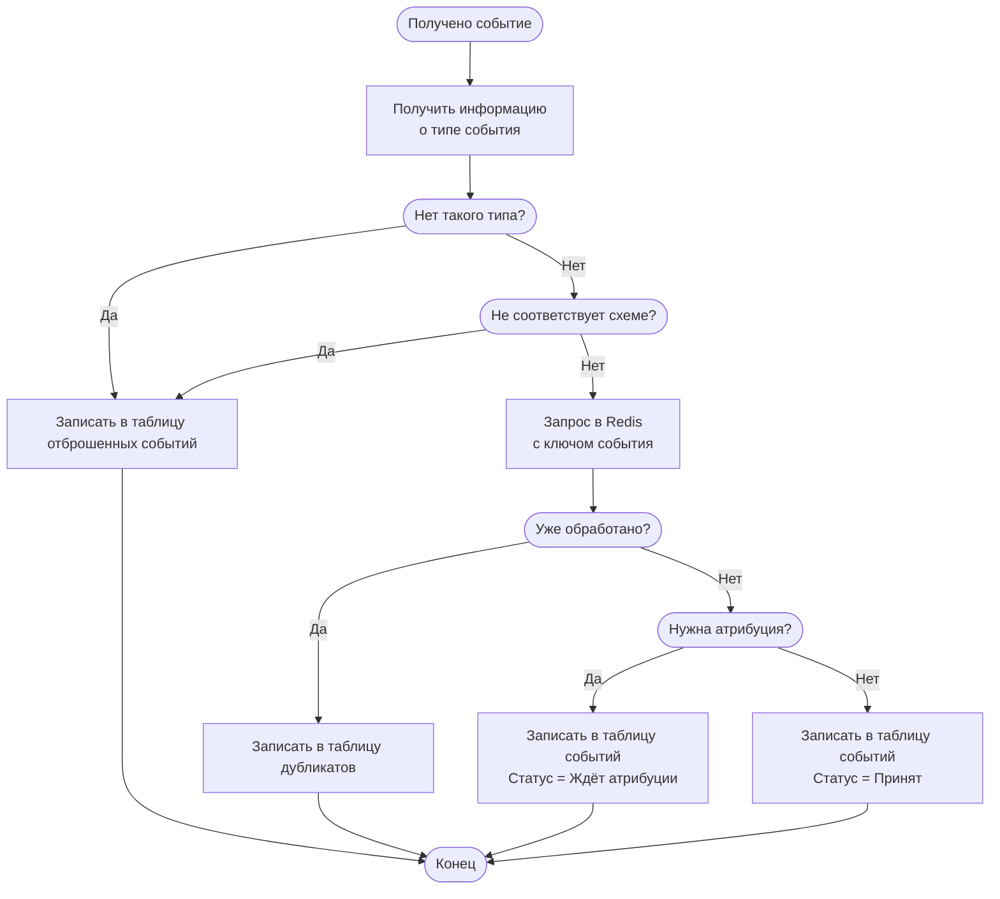

# Сбор событий в ClickHouse и Redis

## Контекст и проблема

В платформе A/B тестирования существует настраиваемый Каталог событий, который перечисляет
возможные типы событий в системе. У каждого типа события есть:

- <evt:ID Типа>
- название
- <evt:Схема события>
- <evt:Политика атрибуции>
- архивирован? (да/нет)

Когда в систему приходит пачка событий, каждое из них содержит:

- <evt:ID> События
- <rt:ID Решения> о выдаче варианта флага в эксперименте
- <evt:Тип события>
- временная метка события
- дополнительные параметры в соответствии со схемой

Требуется:

- принять валидные события
- посчитать, сколько:
    - **принято** — принято и учтено/поставлено в ожидание атрибуции,
    - **дубликатов** — повтор по «идентификатор события»,
    - **отклонено** — невалидный формат, неизвестный тип, нет обязательных полей и т.д.
- вернуть список ошибок по отклонённым элементам
- иметь возможность далее быстро считать аналитику по событиям (метрики, guardrails, отчёты)

Система имеет ограничения:

- события могут приходить не по порядку (макс. разница — 7 дней)
- ответить, принято или не принято событие, нужно быстро:
- нужно дедуплицировать события по их идентификатору

Событие может требовать атрибуции, то есть требовать наличия уже ранее
произошедшего события в рамках этого же Решения (по ID Решения), в этом
случае этот тип события явно указан в Политике атрибуции.

!!! caution
    Проблема: нельзя отклонять события, не прошедшие атрибуцию сразу, 
    ведь события могут приходить не по порядку.

Хранимое событие, соответственно, имеет дополнительное поле Статус 
(отклонено, принято, ожидает атрибуцию).

## Рассмотренные варианты

- Хранение всего в Postgres
- Потоковая обработка (Flink и др. инструменты)
- Комбинированный подход: хранение событий в ClickHouse (или другой OLAP базе)
  и дополнительном Redis для быстрой дедупликации.

## Решение

Решено использовать Комбинированный подход: 

- храним события в ClickHouse
- храним ключи событий в Redis для быстрой дедупликации

Чтобы атрибутировать запоздавшие события, будем использовать
фоновый процесс, который будет раз в N секунд запрашивать неатрибутированные
события и пытаться произвести атрибуцию. Так же будут отклоняться события,
которые не дождались своей атрибуции (для того, чтобы не замедлять процесс
атрибуции, после 7 дней ожидания больше не будем рассматривать такие события).

### Последствия решения

- Хорошо, потому что ClickHouse предназначен для запросов аналитики и соответствующим
  образом оптимизирован
- Хорошо, потому что дедупликация будет происходить быстро, благодаря KV хранилищу
- Плохо, потому что операция обновления строки в ClickHouse очень медленная,
  нужно искать решение.
- Плохо, потому что требует настройки и сопровождения 2 дополнительных сервисов.

### Реализация

При сохранении события, требующего атрибуцию, сразу указывается тип ожидаемого события,
чтобы запросы атрибуции затрагивали только ClickHouse (без доп. похода в Postgres или кэш).

При сохранении события в таблицу отклонённых, будет указываться в дополнительном поле
причина отклонения короткой строкой, по которой можно будет потом сагрегировать статистику.

!!! caution
    Поход в Postgres при получении информации о типе события очень дорогой.
    Способ оптимизации — тема ADR006.

## "За" и "против"

### Хранить всё в Postgres

- Хорошо, потому что не требует дополнительных затрат на настройку и изучение,
  эта база и так будет использоваться в приложении.
- Хорошо, потому что надёжно (соблюдается ACID, события точно не будут теряться).
- Очень плохо, потому что не оптимизирован для такого использования (тем более постоянных,
  возможно тяжёлых, аналитических запросов).

### Использовать инструменты потоковой обработки

Например, Flink.

- Хорошо, потому что идеально (по крайней мере, на первый взгляд) подходит для
  обработки потока событий.
- Плохо, потому требует сложной инфраструктуры
- Плохо, потому что требует тщательного изучения инструмента

Точно не подходит для MVP.
