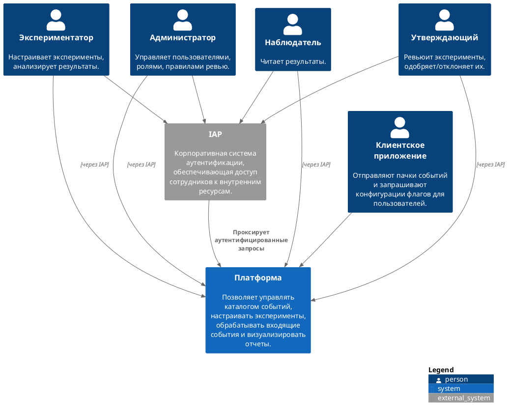
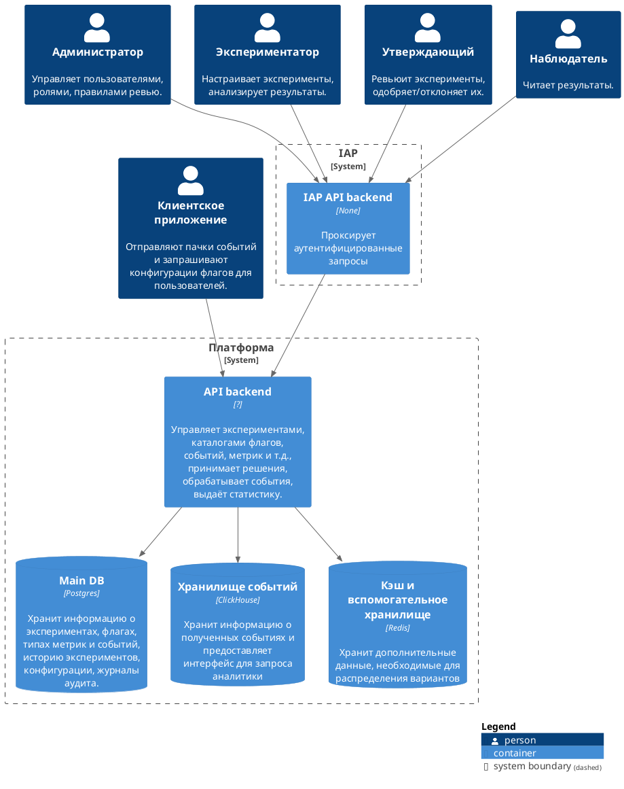
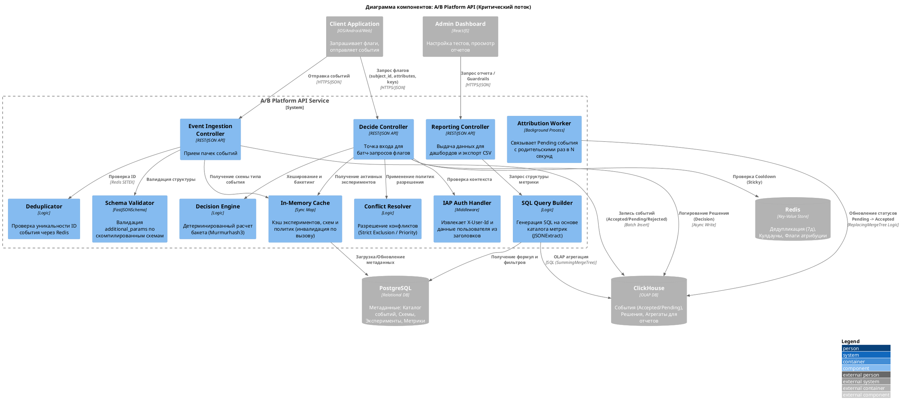

# C4 диаграммы

## 1 — Контекстный уровень

```puml
@startuml
!include <C4/C4_Context>


Person(_0abaee3a, "Администратор", "Управляет пользователями, ролями, правилами ревью.",$tags="")

Person(_709573c9, "Экспериментатор", "Настраивает эксперименты, анализирует результаты.",$tags="")

Person(_a62634f5, "Утверждающий", "Ревьюит эксперименты, одобряет/отклоняет их.",$tags="")

Person(_77459058, "Наблюдатель", "Читает результаты.",$tags="")

Person(__95ef69e6, "Клиентское приложение", "Отправляют пачки событий и запрашивают конфигурации флагов для пользователей.",$tags="")

System(_535e1904, "Платформа", "Позволяет управлять каталогом событий, настраивать эксперименты,\nобрабатывать входящие события и визуализировать отчеты.",$tags="")

System_Ext(IAP, "IAP", "Корпоративная система аутентификации, обеспечивающая доступ сотрудников к внутренним ресурсам.",$tags="")

Rel(_0abaee3a, _535e1904, "","через IAP")

Rel(_0abaee3a, IAP, "","")

Rel(_709573c9, _535e1904, "","через IAP")

Rel(_709573c9, IAP, "","")

Rel(_a62634f5, _535e1904, "","через IAP")

Rel(_a62634f5, IAP, "","")

Rel(_77459058, _535e1904, "","через IAP")

Rel(_77459058, IAP, "","")

Rel(__95ef69e6, _535e1904, "","")

Rel(IAP, _535e1904, "Проксирует аутентифицированные запросы","")

SHOW_LEGEND()
@enduml

```

## 2 — Контейнерный уровень

```puml
@startuml
!include <C4/C4_Container>


System_Boundary(_535e1904,"Платформа"){
    Container(API_backend, "API backend", "Управляет экспериментами, каталогами флагов, событий, метрик и т.д.,\nпринимает решения, обрабатывает события, выдаёт статистику.",$tags="",$techn="?")
    ContainerDb(Main_DB, "Main DB", "Хранит информацию о экспериментах, флагах, типах метрик и событий,\nисторию экспериментов, конфигурации, журналы аудита.",$tags="db",$techn="Postgres")
    ContainerDb(__952b21fc, "Хранилище событий", "Хранит информацию о полученных событиях и предоставляет\nинтерфейс для запроса аналитики",$tags="db",$techn="ClickHouse")
    ContainerDb(____680bbb2a, "Кэш и вспомогательное хранилище", "Хранит дополнительные данные, необходимые для распределения вариантов",$tags="db",$techn="Redis")
}

System_Boundary(IAP,"IAP"){
    Container(IAP_API_backend, "IAP API backend", "Проксирует аутентифицированные запросы",$tags="",$techn="None")
}

Person(__95ef69e6, "Клиентское приложение", "Отправляют пачки событий и запрашивают конфигурации флагов для пользователей.",$tags="")

Person(_0abaee3a, "Администратор", "Управляет пользователями, ролями, правилами ревью.",$tags="")

Person(_709573c9, "Экспериментатор", "Настраивает эксперименты, анализирует результаты.",$tags="")

Person(_a62634f5, "Утверждающий", "Ревьюит эксперименты, одобряет/отклоняет их.",$tags="")

Person(_77459058, "Наблюдатель", "Читает результаты.",$tags="")

Rel(API_backend, Main_DB, "","")

Rel(API_backend, __952b21fc, "","")

Rel(API_backend, ____680bbb2a, "","")

Rel(__95ef69e6, API_backend, "","")

Rel(IAP_API_backend, API_backend, "","")

Rel(_0abaee3a, IAP_API_backend, "","")

Rel(_709573c9, IAP_API_backend, "","")

Rel(_a62634f5, IAP_API_backend, "","")

Rel(_77459058, IAP_API_backend, "","")

SHOW_LEGEND()
@enduml

```

## 3 — Компонентный уровень

(центральной части)

??? проверить на соответствие ???

```puml
@startuml
!include <C4/C4_Component>

LAYOUT_WITH_LEGEND()

title Диаграмма компонентов: A/B Platform API (Критический поток)

Container_Ext(client_app, "Client Application", "iOS/Android/Web", "Запрашивает флаги, отправляет события")
Container_Ext(admin_ui, "Admin Dashboard", "React/JS", "Настройка тестов, просмотр отчетов")

ContainerDb_Ext(postgres, "PostgreSQL", "Relational DB", "Метаданные: Каталог событий, Схемы, Эксперименты, Метрики")
ContainerDb_Ext(redis, "Redis", "Key-Value Store", "Дедупликация (7д), Кулдауны, Флаги атрибуции")
ContainerDb_Ext(clickhouse, "ClickHouse", "OLAP DB", "События (Accepted/Pending), Решения, Агрегаты для отчетов")

System_Boundary(ab_api, "A/B Platform API Service") {
    
    Component(iap_handler, "IAP Auth Handler", "Middleware", "Извлекает X-User-Id и данные пользователя из заголовков")
    
    ' Блок Принятия решений (Decide)
    Component(decide_controller, "Decide Controller", "REST/JSON API", "Точка входа для батч-запросов флагов")
    Component(decision_engine, "Decision Engine", "Logic", "Детерминированный расчет бакета (Murmurhash3)")
    Component(conflict_resolver, "Conflict Resolver", "Logic", "Разрешение конфликтов (Strict Exclusion / Priority)")
    
    ' Блок Сбора событий (Event)
    Component(event_controller, "Event Ingestion Controller", "REST/JSON API", "Прием пачек событий")
    Component(validator, "Schema Validator", "FastJSONSchema", "Валидация additional_params по скомпилированным схемам")
    Component(deduplicator, "Deduplicator", "Logic", "Проверка уникальности ID события через Redis")
    Component(attr_worker, "Attribution Worker", "Background Process", "Связывает Pending события с родительскими раз в N секунд")

    ' Блок Аналитики (Report/Guardrail)
    Component(report_controller, "Reporting Controller", "REST/JSON API", "Выдача данных для дашбордов и экспорт CSV")
    Component(query_builder, "SQL Query Builder", "Logic", "Генерация SQL на основе каталога метрик (JSONExtract)")

    ' Общий слой данных
    Component(local_cache, "In-Memory Cache", "Sync Map", "Кэш экспериментов, схем и политик (инвалидация по вызову)")
}

' Связи Decide
Rel(client_app, decide_controller, "Запрос флагов (subject_id, attributes, keys)", "HTTPS/JSON")
Rel(decide_controller, iap_handler, "Проверка контекста")
Rel(decide_controller, local_cache, "Получение активных экспериментов")
Rel(decide_controller, redis, "Проверка Cooldown (Sticky)")
Rel(decide_controller, conflict_resolver, "Применение политик разрешения")
Rel(decide_controller, decision_engine, "Хеширование и бакетинг")
Rel(decide_controller, clickhouse, "Логирование Решения (Decision)", "Async Write")

' Связи Event
Rel(client_app, event_controller, "Отправка событий", "HTTPS/JSON")
Rel(event_controller, local_cache, "Получение схемы типа события")
Rel(event_controller, validator, "Валидация структуры")
Rel(event_controller, deduplicator, "Проверка ID", "Redis SETEX")
Rel(event_controller, clickhouse, "Запись событий (Accepted/Pending/Rejected)", "Batch Insert")
Rel_D(attr_worker, clickhouse, "Обновление статусов Pending -> Accepted", "ReplacingMergeTree Logic")

' Связи Report
Rel(admin_ui, report_controller, "Запрос отчета / Guardrails", "HTTPS/JSON")
Rel(report_controller, query_builder, "Запрос структуры метрики")
Rel(query_builder, postgres, "Получение формул и фильтров")
Rel(query_builder, clickhouse, "OLAP агрегация", "SQL (SummingMergeTree)")

' Синхронизация кэша
Rel_U(local_cache, postgres, "Загрузка/Обновление метаданных")

@enduml

```
