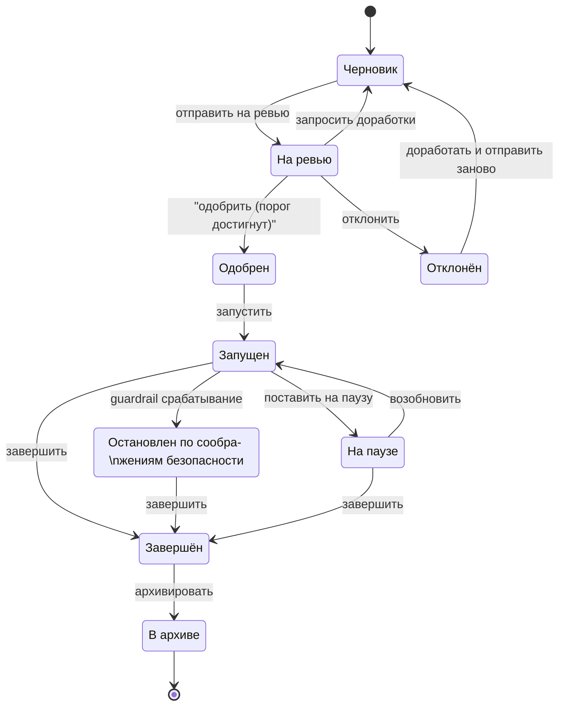

# Feature flags

## Сущности

### Feature flag

{{ decorated_definition("exp", "Feature flag") }}

- <exp:Ключ флага>
- описание флага (необязательно)
- значение по умолчанию
- <exp:Тип флага>
- <access:ID> пользователя, создавшего флаг
- время создания флага
- время последнего изменения флага

### Эксперимент

{{ decorated_definition("exp", "Эксперимент") }}

- <exp:ID>
- название эксперимента
- <exp:Ключ флага>, затронутого экспериментом
- <exp:Статус>
- <exp:Версия>
- доля аудитории (число процентов)
- список <exp:Вариант|Вариантов>
- <exp:Правило таргетированиая> (опционально)
- <access:ID> автора эксперимента
- время создания
- время последнего изменения
- итог эксперимента
- <exp:Метрика|Метрики> эксперимента из каталога
- <exp:Приоритет> (опционально)
- <exp:Конфликтный домен> (опционально)
- <exp:Политика разрешения конфликта> (опционально)

**Инварианты**

- сумма весов инвариантов равна доле аудитории эксперимента
- ровно 1 вариант является контрольным
- ровно 1 эксперимент со статусом "запущен" на 1 флаг
- итог эксперимента присутствует тогда и только тогда, когда Статус = В архиве
- конфликтный домен и политика разрешения либо одновременно не заданы, либо
  одновременно заданы оба

**Диаграмма статусов**:

!!! note
    Не предусмотрено возврата из "Остановлен по соображениям безопасности"
    обратно в состояние "Запущен", так как:

    1. Это небезопасно, вариант может снова начать деградировать
    2. Даже если вариант уже исправлен, статистика испорчена деградацией

## Объекты-значения

### Вариант

{{ decorated_definition("exp", "Вариант") }}

- название варианта
- значение варианта
- признак контрольного варианта (да/нет)
- вес варианта (доля аудитории варианта, в процентах)

### Итог эксперимента

{{ decorated_definition("exp", "Итог эксперимента") }}

- тип итога эксперимента
- комментарий (строка)

## Сценарии

### Создание флага

**Кто**: <access:Экспериментатор>

**Ограничения**:

- <exp:Ключ флага> уникален

**Шаги**:

1. Создание флага с указанным ключом, типом, значением по умолчанию и описанием
2. Система автоматически заполняет владельца флага и время создания и изменения

### Получение списка флагов

**Кто**: любой пользователь

### Обновление флага

**Кто**: <access:Экспериментатор>

**Ограничения**:

- Обновлять можно только значение по умолчанию

### Создание эксперимента

**Кто**: <access:Экспериментатор>

**Шаги**:

1. Генерация <exp:ID> 
2. Создание эксперимента с указанным названием, ключом флага, долей аудитории, 
    вариантами, таргетированием и метриками
3. Статус = Черновик, Версия = 1

### Отправка на ревью

**Кто**: <access:Экспериментатор>

**Ограничения**:

- Статус = Черновик

**Шаги**:

1. Статус = На ревью

### Восстановление черновика

**Кто**: <access:Экспериментатор>

**Ограничения**:

- Статус = Отклонён

**Шаги**:

1. Статус = Черновик

### Отклонение черновика

**Кто**: <access:Утверждающий>

**Ограничения**:

- <access:ID> Утверждающего в списке Утверждающих Экспериментатора
- Статус = На ревью

**Шаги**:

1. Статус = Отклонён
2. Удалить все факты одобрения для этого эксперимента

### Одобрить черновик

**Кто**: <access:Утверждающий>, <access:Администратор>

**Ограничения**:

- <access:ID> Утверждающего в списке Утверждающих Экспериментатора
- Статус = На ревью

**Шаги**:

1. Добавить одобрение для этого черновика
2. Если не заданы параметры утверждающих для этого экспериментатора:

   1. Если Актор — Администратор, то Статус = Одобрен

3. Иначе если одобрений >= необходимо для этого экспериментатора:
    
   1. Статус = Одобрен

### Запуск

**Кто**: <access:Экспериментатор>

**Ограничения**:

- Статус = Одобрен
- Нет уже запущенного или на паузе эксперимента с таким же Ключом флага

**Шаги**:

1. Статус = Запущен

### Управление запущенным экспериментом

**Кто**: <access:Экспериментатор>

**Ограничения**:

- Переход Запущен -> На паузе
- Переход На паузе -> Запущен
- Переход Запущен -> Завершён
- Переход На паузе -> Завершён
- Переход Остановлен по соображениям безопасности -> Завершён

### Подведение итогов и архивация

**Кто**: <access:Экспериментатор>

**Ограничения**:

- Статус = Завершён

**Шаги**:

1. Создать нужный вариант Итога эксперимента с комментарием
2. Статус = В архиве

### Просмотр версии эксперимента

**Кто**: кто угодно

### Просмотр истории версий эксперимента

**Кто**: кто угодно

### Изменение эксперимента

**Кто**: <access:Экспериментатор>

**Ограничения**:

- Статус == Черновик

!!! note
    Изменять можно только черновик, так как:

    - Изменять запущенный эксперимент по условиям нельзя.
    - Изменять эксперимент после согласования нельзя, так как
        могут быть внесены опасные изменения, которые не были бы согласованы.
    - Изменять остановленный и архивированный эксперимент нельзя,
        так как это нарушает историческую правдивость.

**Шаги**:

1. Изменить эксперимент в соответствии с новыми:
    - названием
    - аудиторией
    - ключом флага
    - списком вариантов
    - таргетированием
    - метриками
    - конфликтным доменом
    - политикой разрешения
    - приоритетом
